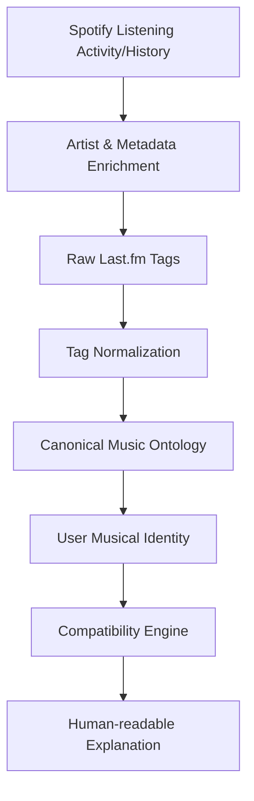

# Sonique
**A deterministic, identity-first music compatibility platform.**

Sonique seeks to deeply understand a person's musical identity using their Spotify listening activity. By analyzing listening behavior, extracting semantic metadata, and building a structured ontology, Sonique provides a transparent, explainable view into *who* you are musically, and *how* you relate to others. 

Rather than acting as a recommendation engine, Sonique focuses on precise, deterministic measurements of musical identity.

---

## 🚀 Live Deployment
- **Frontend:** [https://sonique-frontend-3wyz.onrender.com](https://sonique-frontend-3wyz.onrender.com)
- **Backend:** [https://sonique-backend-o5gw.onrender.com](https://sonique-backend-o5gw.onrender.com)

> **⚠️ Spotify Platform Limitation:** The current Spotify Developer Mode setup limits Sonique testing to 5 explicitly whitelisted users. Because of this limitation, the deployed version functions primarily as a portfolio/demo deployment rather than a public social network.

---

## 🔑 Key Features
- **Secure Authentication:** Standard JWT-based user authentication.
- **Spotify OAuth Integration:** Secure connection to Spotify to ingest listening activity in the background.
- **Semantic Metadata Enrichment:** Uses Last.fm APIs to tag artists and songs with descriptive metadata.
- **Tag Normalization:** Maps messy, raw user-generated tags into a Canonical Music Ontology.
- **Identity Generation:** Builds a cached `UserProfile` that separates *Musical Taste* (what you listen to) from *Listening Style* (how you listen).
- **Compatibility Engine:** Calculates deterministic, mathematical match scores between users based on explicit data intersections.
- **AI-Assisted Explanations:** Uses Google Gemini to translate raw mathematical compatibility data into natural, engaging summaries.

---

## ⚙️ How It Works



### Deterministic Compatibility vs. AI
Compatibility in Sonique is entirely deterministic. It computes strict, mathematical intersections of weighted metadata. AI (Gemini) is explicitly constrained to a presentation layer—it never guesses how compatible two users are, but rather translates the calculated deterministic results into human-readable text, ensuring explainability.

---

## 🏗️ Architecture & Tech Stack

**Backend:**
- Java 17 / Spring Boot 3
- Spring Security / JWT (Stateless authentication)
- PostgreSQL (Database, hosted on Neon)
- Spring Data JPA / Hibernate
- External Integrations: Spotify Web API, Last.fm API, Google Gemini API

**Frontend:**
- React 19 / TypeScript
- Vite
- Tailwind CSS 4

**Deployment:**
- Docker
- Render

---

## 💻 Local Setup Instructions

### Prerequisites
- Java 17
- Node.js 18+
- PostgreSQL
- API Keys for Spotify, Last.fm, and Google Gemini

### Backend Setup
1. Navigate to the root directory.
2. Set the required environment variables (see below).
3. Build and run using the Maven wrapper:
   ```bash
   ./mvnw clean install
   ./mvnw spring-boot:run
   ```

### Frontend Setup
1. Navigate to the frontend directory:
   ```bash
   cd sonique-frontend
   ```
2. Install dependencies:
   ```bash
   npm install
   ```
3. Configure environment variables (see below).
4. Start the development server:
   ```bash
   npm run dev
   ```

---

## 🛠️ Environment Variables

### Backend
Since Spring Boot reads environment variables natively, you must export these in your terminal or configure them in your IDE's run configuration prior to starting the backend:

```env
DB_URL=jdbc:postgresql://localhost:5432/sonique
DB_USERNAME=your_db_username
DB_PASSWORD=your_db_password
JWT_SECRET=your_jwt_secret

SPOTIFY_CLIENT_ID=your_spotify_client_id
SPOTIFY_CLIENT_SECRET=your_spotify_client_secret
SPOTIFY_STATE_SECRET=your_spotify_state_secret

# For local development:
SPOTIFY_REDIRECT_URI=http://localhost:8080/spotify/callback

# For production deployment:
# SPOTIFY_REDIRECT_URI=https://sonique-backend-o5gw.onrender.com/spotify/callback
# Note: The production callback URL must also be registered in the Spotify Developer Dashboard.

LASTFM_API_KEY=your_lastfm_api_key
GEMINI_API_KEY=your_gemini_api_key
```

### Frontend (`sonique-frontend/.env`)
Vite supports `.env` files automatically. Create a `.env` file in the `sonique-frontend` directory:
```env
# Defaults to http://localhost:8080 if not provided
VITE_API_BASE_URL=http://localhost:8080
```

---

## 📖 Documentation
Detailed technical specifications driving the platform's logic can be found in the [Compatibility Engine Specification](docs/COMPATIBILITY_ENGINE.md).
