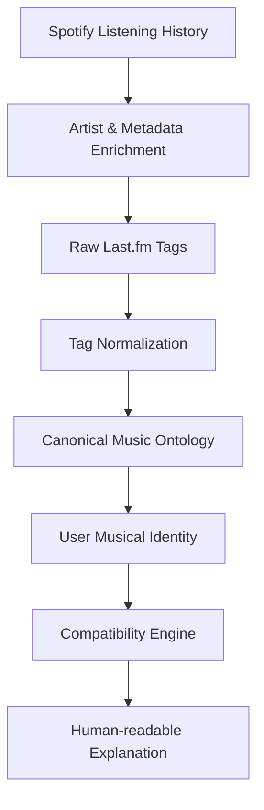

# Sonique

**A deterministic, identity-first music compatibility platform.**

Sonique is not primarily trying to recommend music. Instead, it seeks to deeply understand a person's musical identity and compare that identity with another person's. By analyzing listening behavior, extracting semantic metadata, and building a structured ontology, Sonique provides a transparent, explainable view into *who* you are musically, and *how* you relate to others.

---

## What Sonique Is

Sonique uses Spotify as a rich source of listening data, but the product itself is the identity engine. The core data pipeline flows as follows:



## Core Philosophy

Sonique is built on several foundational engineering and product principles:

- **Identity-First:** The platform exists to model your unique sonic footprint before attempting to match you with anyone else.
- **Deterministic Computation:** Compatibility is calculated using strict, mathematical intersections of weighted metadata, not opaque black-box embeddings.
- **Explainability:** Every score or metric can be traced back to the exact artists and traits you share.
- **AI-Assisted, Not AI-Determined:** Generative AI is used to translate complex data into natural language, not to randomly guess how compatible two users are.
- **Spotify as a Data Source:** Spotify provides the raw fuel (listening history), but Sonique owns the identity layer.

### Listening Style vs. Musical Taste
Sonique draws a hard line between these two concepts:
- **Musical Taste (WHAT you listen to):** Genres, musical traits, vocal characteristics, and unique niche preferences.
- **Listening Style (HOW you listen):** Exploration rates, artist diversity, average track age, and dominant listening time windows.

---

## Architecture

The Sonique backend operates across several specialized layers to translate raw history into a cached identity.

1. **Authentication:** Standard JWT-based user authentication.
2. **Spotify OAuth:** Connects the user's Spotify account, persisting tokens for background synchronization.
3. **Listening History Ingestion:** Fetches and stores the user's recently played tracks.
4. **Metadata Enrichment:** Queries external sources (like Last.fm) to gather descriptive tags for artists and songs.
5. **Tag Normalization & Canonical Ontology:** Maps messy, user-generated tags into a structured hierarchical ontology.
6. **User Profile (Cached Identity):** Aggregates the normalized tags into a `UserProfile` entity. This acts as a cached identity layer, ensuring the compatibility engine does not need to reconstruct your identity from thousands of raw listening records on the fly.
7. **Compatibility Engine:** Deterministically compares two cached profiles.
8. **Gemini Explanation:** Transforms the mathematical compatibility output into a natural, engaging summary.

---

## Tag Normalization

Raw Last.fm tags are notoriously messy (e.g., "seen live", "awesome", "indie pop"). Sonique does not directly compare these raw tags. Instead, they are normalized into a **Canonical Ontology** so that true semantic relationships can be understood.

- **TagMappings:** Maps raw tags to recognized canonical tags.
- **Hierarchy:** Understands parent/child/sibling relationships (e.g., "Deep House" is a child of "Electronic").
- **Ignored Tags:** Actively discards subjective or meaningless tags that pollute identity data.

---

## Compatibility

Compatibility in Sonique is:
- **Deterministic:** Computed using explicit mathematical overlap.
- **Ontology-Aware:** Understands that sharing a highly specific sub-genre means more than sharing a generic parent genre.
- **Identity-Based:** Uses the cached user profile, separating taste from style.
- **Computed On-Demand:** Calculates relationships in real-time without persisting a matrix of all possible user pairs.

For the detailed mathematical specifications and implementation details, see the [Compatibility Engine Specification](docs/COMPATIBILITY_ENGINE.md).

---

## AI / Gemini Philosophy

A critical engineering decision in Sonique is the strict boundary placed around Generative AI. 

**Gemini is NOT the compatibility engine.** 

The actual identity generation and compatibility computation remain entirely deterministic. Gemini is strictly utilized as an assistance and presentation layer:
- Assisting with tag normalization categorization where implemented.
- Converting the deterministic, data-heavy compatibility signals into natural-language explanations for the user interface.

This ensures the platform remains accurate, explainable, and free from AI hallucination in its core scoring.

---

## Major Engineering Decisions

- **Deterministic Compatibility:** Avoids unpredictable AI hallucinations in core scoring logic.
- **Cached User Identity:** Generates a unified `UserProfile` to massively improve compatibility calculation performance.
- **On-Demand Compatibility:** Avoids the N^2 database explosion problem of pre-calculating every user's match score against everyone else.
- **Separation of Ingestion and Generation:** Spotify data is ingested and normalized iteratively, decoupling raw API limits from the user's internal identity score.
- **Scheduler-Based Synchronization:** Background workers (e.g., `SpotifySyncScheduler`) keep listening history updated without blocking user requests.
- **Normalization Before Comparison:** Prevents false negatives (e.g., failing to match "Hip-Hop" with "Hip Hop").

---

## ⚠️ Spotify Platform Limitation

**Sonique currently operates in Spotify Developer Mode.**

- Spotify restricts applications in Developer Mode to a maximum of **5 explicitly whitelisted users**.
- Because of this external limitation, the current deployed/demo version cannot function as an unrestricted public social network.
- The application implements robust token persistence and background refresh lifecycles, and is fully architected to support scale once Spotify quota extensions are granted.

---

## Current Project State

The following core features are fully implemented and functional in the repository:

- [x] JWT User Authentication
- [x] Spotify OAuth Integration & Token Management
- [x] Background Listening-History Ingestion
- [x] Artist/Song Persistence
- [x] Last.fm Tag Enrichment
- [x] Tag Normalization & Canonical Ontology Mapping
- [x] Deterministic User Identity Generation (Cached Profiles)
- [x] Deterministic Compatibility Engine (Taste & Style)
- [x] Gemini Compatibility Explanations
- [x] React Frontend (Authentication, Spotify Onboarding, Identity Dashboard, Compatibility View, Account Management)

---

## Frontend User Flow

The Sonique frontend follows a focused, linear onboarding and exploration path:

1. **Authentication:** Register or Log in.
2. **Spotify Connection:** Secure OAuth flow to link listening data.
3. **Identity:** A dynamic dashboard visualizing your normalized musical taste and listening style.
4. **Compatibility:** Compare your cached identity against others.
5. **Account:** Manage session state and external connections.

---

## Tech Stack

### Backend
- **Java 17**
- **Spring Boot 3** (Web, Security, Data JPA)
- **PostgreSQL** (Relational data persistence)
- **JWT** (Stateless authentication)

### Frontend
- **React 19**
- **TypeScript**
- **Vite**
- **Tailwind CSS 4** (Utility-first styling)

### External APIs
- **Spotify Web API** (Listening data, OAuth)
- **Last.fm API** (Metadata, Tag enrichment)
- **Google Gemini API** (Natural language explanation)

---

## Project Structure

```text
sonique/
├── docs/                        # Technical specifications
│   └── COMPATIBILITY_ENGINE.md  # Detailed math/logic for compatibility scoring
├── sonique-frontend/            # React/Vite web application
│   └── src/
│       ├── components/          # Reusable UI elements
│       └── pages/               # Top-level screen views
└── src/
    └── main/
        └── java/com/synshami/sonique/
            ├── controller/      # REST API endpoints
            ├── service/         # Core business logic (Spotify, Gemini, Identity)
            ├── scheduler/       # Background sync workers
            ├── entity/          # JPA Domain models
            └── repository/      # Database access layer
```

---

## Documentation

The detailed technical specifications driving the platform's logic can be found in the `docs` directory. 

- [Compatibility Engine Specification](docs/COMPATIBILITY_ENGINE.md)

---

## Why Sonique?

Most modern music platforms are built around recommendation algorithms, asking: *"What should this person listen to?"*

Sonique flips the paradigm. It asks: **"What does this person's listening reveal about their musical identity, and how does that identity compare with someone else's?"**

Sonique does not claim to predict relationship success or deeply analyze real-world personality traits. It is a precise, deterministic measurement of musical identity, extracted from observable listening behavior.
